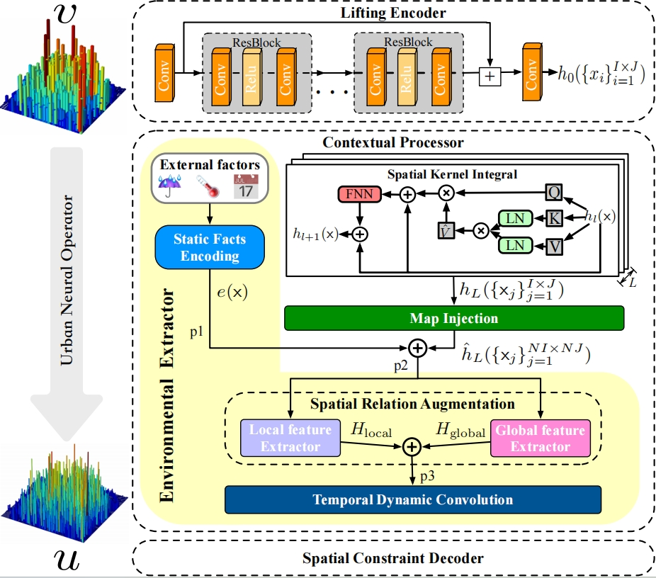

# Enhancing Fine-Grained Urban Flow Inference via Incremental Neural Operator

This repository provides a reference implementation of the paper: *Enhancing Fine-Grained Urban Flow Inference via Incremental Neural Operator*
## Overview

​                                                                        

Fine-grained urban flow inference (FUFI), which involves inferring fine-grained flow maps from their coarse-grained counterparts, is of tremendous interest in the realm of sustainable urban traffic services. To address the FUFI, existing solutions mainly concentrate on investigating spatial dependencies, introducing external factors, reducing excessive memory costs, etc., – while rarely considering the catastrophic forgetting (CF) problem. Motivated by recent operator learning, we present an Urban Neural Operator solution with Incremental learning (UNOI), primarily seeking to learn grained-invariant solutions for FUFI in addition to addressing CF. Specifically, we devise an urban neural operator (UNO) in UNOI that learnsmappings between approximation spaces by treating the different grained flows as continuous functions, allowing a more flexible capture of spatial correlations. Furthermore, the phenomenon of CF behind time-related flows could hinder the capture of flow dynamics. Thus, UNOI mitigates CF concerns as well as privacy issues by placing UNO blocks in two incremental settings, i.e., flow-related and task-related. Experimental results on large-scale real-world datasets demonstrate the superiority of our proposed solution against the baselines.

## Requirements
We implement ENHANCER and other FUFI methods with the following dependencies:
* python 3.11.5
* pytorch 2.1.2
* einops
* scikit-learn

## Datasets
TaxiBJ datasets can be obtained from the baseline [UrbanFM's repository](https://github.com/yoshall/UrbanFM/tree/master/data).

## Usage
Before running the code,ensure the package structure of ENHANCER is as follows:
```
.
├── datasets
│   └── TaxiBJ
│       ├── P1
│       ├── P2
│       ├── P3
│       └── P4
├── experiments
├── model
├── model_train
└── utils_pack
```


## Citing
If you find UNO is useful in your research, please cite the following paper:
```
@inproceedings{gao2024uno,
  title={Enhancing Fine-Grained Urban Flow Inference via Incremental Neural Operator},
  author={Qiang Gao, Xiaolong Song, Li Huang, Goce Trajcevski, Fan Zhou and Xueqin Chen},
  booktitle={IJCAI},
  year={2024}
}
```